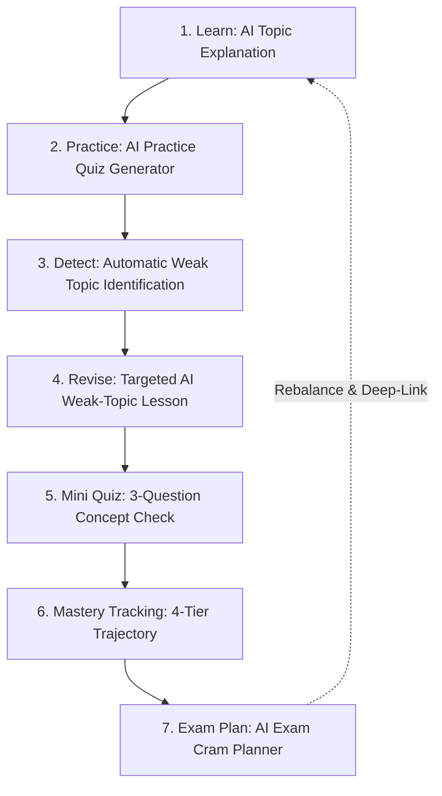

# Study Buddy AI 🎓⚡

> **An all-in-one, privacy-first college productivity and adaptive learning platform built with vanilla HTML, CSS, and JavaScript—combining Pomodoro focus, task & mock test tracking, and an AI-driven study loop (Explanation → Quizzing → Weak-Topic Detection → Targeted Revision → Mini-Quiz Mastery → Dynamic Exam Cram Planning) with optional live Google Gemini API integration and instant offline fallbacks.**

Developed for the **CodeMyFYP HACK 26** Hackathon.

---

## 📌 Problem Statement

College students face severe cognitive overload and fragmented study routines when preparing for semester examinations:

1. **Fragmented Tooling**: Students constantly context-switch across disconnected apps—using one app for Pomodoro timers, another for daily to-dos, spreadsheets for mock test tracking, and external AI tools for doubt solving.
2. **Passive, Disconnected AI**: Most AI study tools operate as generic, one-off chatbots. They do not diagnose *why* a student got an exam question wrong, do not remember past weaknesses, and cannot synthesize targeted practice around weak sub-concepts.
3. **Lack of Adaptive Revision**: When exams loom, students either reread entire textbooks or study haphazardly without a structured, high-yield schedule that prioritizes their personal knowledge gaps.
4. **Heavy Dependencies & Privacy Issues**: Many student apps require mandatory account registration, paywalled subscriptions, active backend servers, or send sensitive study data to remote databases.

---

## 🎯 Target Users

- **College & University Students**: Undergraduates in Computer Science, Engineering, Sciences, and Humanities preparing for semester finals, midterms, and lab vivas.
- **Competitive Exam Aspirants**: Students preparing for high-stakes examinations (GATE, GRE, technical placement tests) requiring rigorous time management and active recall.
- **Self-Directed Learners**: Anyone who wants a structured, distraction-free study operating system that runs entirely in their browser without paywalls or tracking.

---

## 💡 Solution

**Study Buddy AI** unites daily academic task management and focus timers with an **adaptive, closed-loop AI learning engine**.

Rather than treating AI as a passive chat prompt, Study Buddy AI embeds AI into a continuous mastery pipeline:
- It explains complex academic topics across three customizable depth levels with a 9-part structured teaching framework.
- It tests retention with randomized, timed practice quizzes.
- It analyzes incorrect quiz answers to automatically extract specific weak concepts.
- It immediately generates targeted revision lessons and 3-question mini-quizzes to turn weaknesses into strengths.
- It charts concept retention onto a 4-tier mastery trajectory (**Weak → Revising → Improving → Mastered**).
- It feeds diagnosed weak topics directly into an **AI Exam Cram Planner**, scheduling high-impact daily revision blocks tailored to the student's exact exam deadline.

Everything runs purely on the client side using **vanilla HTML5, CSS3, and JavaScript**, storing data locally in the browser with full offline reliability.

---

## 🔄 AI Learning Workflow

Study Buddy AI structures studying around an active recall and diagnostic feedback loop:



### The 7-Step Workflow Breakdown:

1. **Learn (`AI Topic Explanation`)**: The student learns a subject topic using the AI assistant, structured into a 9-part pedagogical breakdown (Intuition, Analogies, Code/Formula, Step-by-Step, Pitfalls, and Exam Summary).
2. **Practice (`AI Practice Quiz Generator`)**: The student generates a 3 to 10 question quiz across Easy, Medium, or Hard difficulty with an active timer and randomized options.
3. **Detect Weakness (`Weak Topic Detection`)**: Upon submitting the quiz, the engine cross-references missed questions against concept tags (`q.concept`), isolating specific knowledge gaps (e.g., *Dynamic Programming Memoization*, *Recursion Base Cases*).
4. **Revise (`AI Weak-Topic Revision`)**: The student launches a one-click revision session generated specifically for that weak concept, explaining the exact intuition and real-world analogy needed to clarify the misconception.
5. **Mini Quiz (`Validation Check`)**: The student attempts a rapid 3-question mini-quiz focused strictly on the revised concept.
6. **Mastery (`4-Tier Trajectory Tracking`)**:
   - ⚠️ **Weak**: Flagged after missed quiz questions or mock tests.
   - 📖 **Revising**: Active engagement in targeted concept lessons.
   - 📈 **Improving**: Scored 2/3 (partial mastery) on the concept mini-quiz.
   - 🏆 **Mastered**: Flawless 3/3 score on the concept mini-quiz.
7. **Exam Plan (`AI Exam Cram Planner`)**: When building an exam cram plan, the planner ingests the student's detected weak topics and prioritizes them in early daily study blocks, ensuring weak areas are mastered before exam day.

---

## ✨ Key Features

### 1. 🧠 AI Topic Explanation
- Comprehensive, 9-part pedagogical breakdown designed for college academics:
  1. Core Definition
  2. Why it is used / Problem it solves
  3. Simple Intuition
  4. Real-World Analogy
  5. Concrete Academic Example (Code snippet, math calculation, or theory scenario)
  6. Step-by-Step Execution Walkthrough
  7. Key Concepts, Formulas & Terms
  8. Common Mistakes Students Make on University Exams
  9. Short Exam-Ready Summary
- Three selectable conceptual depth tiers:
  - **Beginner / Intuitive**: High-level analogies and zero jargon.
  - **Standard Exam-Ready**: Balanced college curriculum explanation with key formulas and definitions.
  - **Deep Academic Dive**: Rigorous mathematical or algorithmic proofs, edge cases, and architectural trade-offs.

### 2. 📝 AI Practice Quiz Generator
- Generates custom multi-choice quizzes for any college topic.
- Customizable parameters: Question count (3, 5, 8, 10) and difficulty level (**Easy**, **Medium**, **Hard**).
- Shuffled multiple-choice options, active countdown timer, real-time question progress bar, and instant answer rationales.
- Automatically pushes test results, duration, and detected weak concepts into the student's historical mock test records.

### 3. ⚠️ Weak Topic Detection
- Diagnoses specific conceptual gaps rather than presenting a generic percentage score.
- Maps question-level concept metadata (`q.concept`) to identify exact failure points (e.g., *Pointer Arithmetic*, *Free-Body Diagrams*, *Thermodynamic Cycles*).
- Displays actionable diagnostic cards with direct "Revise ⚡" action triggers.

### 4. ⚡ AI Weak-Topic Revision
- High-yield, targeted micro-lessons focused exclusively on eliminating the diagnosed conceptual misunderstanding.
- Synthesizes clear intuition, analogies, and exam pitfalls to correct misconceptions without forcing the student to re-read entire chapters.

### 5. 🏆 Mini Quiz and Mastery Tracking
- 3-question rapid-fire validation quizzes linked to each revised weak topic.
- Dynamic visual stepper tracking concept retention across 4 states:
  - **Weak** (⚠️) → **Revising** (📖) → **Improving** (📈) → **Mastered** (🏆)
- Full historical log of attempts, previous scores, and improvement trajectories persisted in `localStorage`.

### 6. 📅 AI Exam Cram Planner
- Generates an adaptive, day-by-day study schedule based on:
  - Subject/Exam name
  - Exam date (calculates remaining calendar days)
  - Daily available study hours (1h to 8h)
  - Custom syllabus topic input
- Ingests detected weak topics automatically, allocating High-Priority sessions on Days 1–3.
- Assigns specific session activity types: *Learn*, *Practice Quiz*, *Revise*, *Mini Quiz*, *Mock Test*, and *Final Review*.
- Includes 10–15 minute restorative breaks between intense study sessions.
- **Dynamic Rebalancing**: If a student falls behind, the "Rebalance Plan" engine reschedules uncompleted sessions into remaining days.
- **Deep-Link Launchers**: Every scheduled session row includes one-click action buttons to directly jump into AI Explanation, Practice Quiz, or Weak Topic Revision.

### 7. 📚 Subject, Task & To-Do Management
- **Subject Hub**: Track college courses with course codes, weekly study targets (hours), color-coding, and visual completion bars.
- **Task Management**: Create assignment and project tasks with due dates, priority tiers (**High**, **Medium**, **Low**), estimated durations, subject filters, and status toggles.
- **Daily Quick To-Dos**: Fast checklist for daily homework and revision items with progress counters.

### 8. ⏱️ Study Timer & Pomodoro Engine
- 4 timer modes: **Pomodoro** (25 min), **Short Break** (5 min), **Long Break** (15 min), and **Custom Duration** (up to 180 min).
- Integrated **Stopwatch Mode** for open-ended problem solving and lab sessions.
- Session assignment to active subjects for accurate per-subject study analytics.
- Synthesized audio chime using the HTML5 Web Audio API (zero external audio file dependencies).
- Persistent mini-timer pill in the top navigation bar to maintain timer awareness across all application views.

### 9. 📊 Mock Test & PYQ Tracking
- Log full-length mock tests and Previous Year Question (PYQ) attempts.
- Records title, subject, score, maximum marks, duration, date, and user-defined weak areas.
- Automatically integrates results from AI Practice Quizzes and Mini Quizzes.

### 10. 🔥 Progress Tracking, Analytics & Streaks
- **Streak Engine**: Daily streak counter with flame badge, longest streak tracking, and a 7-day rolling visual history track.
- **KPI Overview**: Real-time counters for today's study minutes, tasks completed, to-dos finished, and weekly target progress.
- **SVG Visual Charts**:
  - 7-Day Study Time Bar Chart
  - Subject Study Distribution Chart
  - Task Completion Doughnut/Breakdown
  - Mock Test Score Trajectory Chart

---

## 🛠️ Technology Stack

> **This is a pure Vanilla HTML/CSS/JavaScript project.** No frontend frameworks, build steps, bundlers, or heavy external runtime dependencies are used.

| Layer | Technologies Used | Description |
|---|---|---|
| **Structure** | **HTML5** | Semantic, accessible HTML structure (`<header>`, `<nav>`, `<aside>`, `<main>`, `<dialog>`). |
| **Styling** | **Vanilla CSS3** | Custom properties (CSS variables) for full Dark/Light theming, Glassmorphism, CSS Grid, and Flexbox layouts. |
| **Logic & State** | **Vanilla JavaScript (ES6+)** | Modular IIFE pattern, reactive state management, DOM manipulation, custom event listeners, and timers. |
| **AI Integration** | **Google Gemini REST API** | Direct browser-to-API calls targeting `gemini-2.0-flash` with automatic fallback to `gemini-1.5-flash`. |
| **Offline AI Engine** | **Built-in Academic Fallback** | Deterministic domain-aware academic engine providing instant explanations, quizzes, and plans offline. |
| **Audio** | **HTML5 Web Audio API** | Pure synthetic audio waveform generation (`AudioContext` oscillator); 0 bytes of external audio files. |
| **Typography** | **Google Fonts** | `Plus Jakarta Sans` for clean, modern legibility. |
| **Icons** | **Inline SVG** | Hand-crafted inline SVG icons; zero external icon fonts or CDN stylesheets. |
| **Data Storage** | **Browser LocalStorage** | JSON serialized persistence, schema migration safety, export, and import. |

---

## 🏗️ Architecture & How the Application Works

Study Buddy AI is structured as a client-side Single Page Application (SPA) operating with a clean, unidirectional data flow:

```
┌─────────────────────────────────────────────────────────────┐
│                       Browser DOM                           │
│  ┌───────────────────────────────────────────────────────┐  │
│  │   Views: Dashboard | Subjects | Tasks | To-Dos        │  │
│  │   Timer | Mock Tests | AI Assistant | Cram Planner    │  │
│  └───────────────────────────▲───────────────────────────┘  │
│                              │ Renders HTML / Updates DOM    │
│  ┌───────────────────────────┴───────────────────────────┐  │
│  │               Unidirectional State Store              │  │
│  │            (Central `state` JavaScript Object)        │  │
│  └───────────────▲───────────────────────────┬───────────┘  │
│                  │ User Actions              │ Persists     │
│  ┌───────────────┴──────────┐   ┌────────────▼───────────┐  │
│  │   Event Handlers & APIs  │   │  Browser LocalStorage  │  │
│  │   • Timer Engine         │   │  (study_buddy_data_v3) │  │
│  │   • Gemini REST API      │   │  (study_buddy_theme)   │  │
│  │   • Offline Fallback     │   └────────────────────────┘  │
│  │   • Web Audio Chimes     │                               │
│  └──────────────────────────┘                               │
└─────────────────────────────────────────────────────────────┘
```

1. **Single Entry Point**: All application views (`#view-dashboard`, `#view-subjects`, `#view-tasks`, `#view-todo`, `#view-timer`, `#view-mocktests`, `#view-analytics`, `#view-reminders`, `#view-assistant`) reside in `index.html`.
2. **Central State Model**: A single in-memory JavaScript `state` object acts as the source of truth for subjects, tasks, timers, streaks, chat messages, quizzes, weak topics, and cram plans.
3. **Reactive Re-Rendering**: When an action occurs (e.g., adding a subject, completing a session, or finishing a quiz), the state is updated, committed to `localStorage`, and the corresponding view function re-renders the UI without requiring page reloads.
4. **Drift-Resistant Timer Engine**: The timer calculates time deltas using timestamps (`Date.now()`) rather than relying solely on `setInterval`, preventing timer drift when browser tabs are backgrounded.

---

## 🤖 AI Implementation & Dual-Mode Engine

Study Buddy AI features a resilient dual-mode AI architecture:

### 1. Online Mode: Google Gemini REST API
- **Endpoint**: `https://generativelanguage.googleapis.com/v1beta/models/{model}:generateContent`
- **Models**: Prioritizes `gemini-2.0-flash` for high-speed generation; automatically cascades to `gemini-1.5-flash` if needed.
- **Configured Guardrails**:
  - `system_instruction`: Custom system prompts enforce strict academic formatting, step-by-step reasoning, and prevent generic fluff.
  - `temperature: 0.3`: Low temperature setting to maximize factual correctness and precision in formulas, code syntax, and academic theory.
  - `AbortController`: Enforces a strict 15-second request timeout.
- **Security**: The API key is stored strictly on the user's local device (`localStorage`) and communicated directly to Google over HTTPS. It is never routed through an intermediary proxy server.

### 2. Offline Mode: Built-in Academic Tutor & Quiz Engine
- When no API key is provided, or if the user is offline, or if the Gemini API encounters rate limits/quota exhaustion, the system automatically falls back to its built-in offline engine.
- **Capabilities of the Offline Engine**:
  - Generates comprehensive 9-part topic explanations across core subjects (Data Structures, Algorithms, Physics, Operating Systems, Chemistry, Mathematics).
  - Supplies high-yield practice quiz questions with answer options, correct answer indices, and concept tags.
  - Synthesizes weak-topic revision lessons and 3-question mini-quizzes.
  - Generates realistic day-by-day exam cram plans tailored to the entered syllabus topics.
- Users are notified with an unobtrusive notice, ensuring continuous study without disruption.

---

## 💾 Data Storage & LocalStorage

Study Buddy AI respects student privacy and requires zero user accounts or external databases:

- **Storage Key**: `study_buddy_data_v3` (main application data) and `study_buddy_theme` (theme preference).
- **Data Model Stored**:
  - `subjects`: List of courses, codes, target hours, and colors.
  - `tasks`: Assignment and project tracker with priority and deadlines.
  - `todos`: Daily checklist items.
  - `timer`: Elapsed study seconds, completed cycles, active subject link.
  - `mockTests`: Mock test and PYQ scores, durations, and weak areas.
  - `reminders`: Configured recurring alarms and notifications.
  - `streak`: Current streak, longest streak, last active date, and activity map.
  - `weakTopicMastery`: Concept dictionary tracking mastery state (`Weak`, `Revising`, `Improving`, `Mastered`), attempts, and history.
  - `examPlan`: Active day-by-day exam cram plan, daily targets, and session completion states.
  - `settings`: Visual theme, sound toggle, and optional local Gemini API key.
- **Data Portability**:
  - **Export JSON Backup**: Exports a full, human-readable `.json` backup file with a single click.
  - **Import JSON Backup**: Restores an existing backup with validation checks.
  - **Reset / Wipe**: Allows resetting to sample data or wiping all stored data cleanly.

---

## 🚀 Setup and Installation

Since Study Buddy AI is a client-side vanilla web application, no Node.js installation, build scripts, or package managers are required.

### 1. Clone the Repository
```bash
git clone https://github.com/codewithrudra-27/study-buddy.git
cd study-buddy
```

### 2. Directory Structure
```text
study-buddy/
├── index.html        # Main application markup and view containers
├── style.css         # Complete design system, theme variables, and layouts
├── script.js         # State engine, timer, AI handlers, and DOM controllers
└── README.md         # Documentation and project overview
```

---

## 💻 How to Run Locally using Live Server

The recommended way to run the application locally is using the **VS Code Live Server** extension:

1. Open **Visual Studio Code** (or your preferred editor).
2. Install the **Live Server** extension by *Ritwick Dey* from the VS Code Extensions Marketplace (`Ctrl+Shift+X` or `Cmd+Shift+X` → search for `Live Server`).
3. Open the project folder in VS Code (`File` → `Open Folder...` → select `study-buddy`).
4. Right-click on `index.html` in the file explorer and select **"Open with Live Server"** (or click the **"Go Live"** button in the status bar at the bottom right).
5. Your default browser will automatically open:
   ```text
   http://127.0.0.1:5500/index.html
   ```

### Alternative Ways to Run:
- **Python HTTP Server**:
  ```bash
  python -m http.server 8000
  # Open http://localhost:8000 in your browser
  ```
- **Direct File**: Simply double-click `index.html` to open it directly in any browser (`file:///.../index.html`).

*(Optional)* To enable live Google Gemini responses, open **Settings** (gear icon in header) → paste your **Gemini API Key** → click **Save Key**. The app will immediately use live API responses while keeping the offline fallback ready.

---

## 🌐 Live Demo

- **Repository**: [https://github.com/codewithrudra-27/study-buddy](https://github.com/codewithrudra-27/study-buddy)
- **Live Demo Link**: [https://codewithrudra-27.github.io/study-buddy/](https://codewithrudra-27.github.io/study-buddy/)

---

## 📸 Screenshots

*(Screenshots can be added below to showcase the application interface)*

### 1. Student Command Center & Dashboard
<!-- SCREENSHOT PLACEHOLDER: Main dashboard showing streak counter, KPI cards, today's focus metrics, and quick action shortcuts -->
```
[ Screenshot Placeholder: Dashboard Overview & Study Streak Hero Card ]
```

### 2. AI Study Assistant & 9-Part Topic Explainer
<!-- SCREENSHOT PLACEHOLDER: AI Copilot displaying structured 9-part concept explanation with code snippet, formulas, and pitfalls -->
```
[ Screenshot Placeholder: AI Study Assistant with 9-Part Pedagogical Breakdown ]
```

### 3. AI Practice Quiz Generator with Active Timer
<!-- SCREENSHOT PLACEHOLDER: Active quiz interface showing question counter, countdown timer, options, and instant feedback -->
```
[ Screenshot Placeholder: Interactive AI Practice Quiz Generator ]
```

### 4. Weak Topic Detection & Diagnostic Results
<!-- SCREENSHOT PLACEHOLDER: Quiz score banner displaying accuracy percentage and detected weak concept cards with revision triggers -->
```
[ Screenshot Placeholder: Weak Topic Detection & Diagnostic Score Card ]
```

### 5. Targeted AI Revision & 4-Tier Mastery Stepper
<!-- SCREENSHOT PLACEHOLDER: Targeted revision lesson showing the visual stepper (Weak -> Revising -> Improving -> Mastered) and mini-quiz -->
```
[ Screenshot Placeholder: Weak Topic Revision Lesson & Retention Stepper ]
```

### 6. AI Exam Cram Planner
<!-- SCREENSHOT PLACEHOLDER: Day-by-day exam schedule accordion with priority tags, study sessions, and plan rebalancing controls -->
```
[ Screenshot Placeholder: AI Exam Cram Planner Day-by-Day Timeline ]
```

### 7. Pomodoro Focus Timer & Analytics Dashboard
<!-- SCREENSHOT PLACEHOLDER: Circular Pomodoro focus timer linked to subject, stopwatch mode, and 7-day study time SVG charts -->
```
[ Screenshot Placeholder: Pomodoro Focus Timer & Visual Analytics Charts ]
```

---

## 🧪 Testing and Validation

The application was tested and validated through manual and automated browser testing procedures:

1. **Cross-Browser Verification**: Validated full functionality across modern desktop and mobile browsers including Google Chrome (v120+), Microsoft Edge (v120+), Mozilla Firefox (v120+), and Safari (iOS & macOS).
2. **Timer Precision & Background Stability**:
   - Tested Pomodoro, Short Break, Long Break, and Stopwatch modes for timing accuracy.
   - Tested tab backgrounding: Verified that timestamp delta calculations prevent timer drift when the tab is out of focus.
   - Verified that Web Audio chimes trigger reliably on cycle completion.
3. **State & LocalStorage Resilience**:
   - Verified that all state mutations persist across hard browser reloads (`Ctrl+F5`).
   - Tested corrupt data recovery: Verified that passing invalid or malformed JSON into `localStorage` safely falls back to starter defaults without throwing unhandled exceptions.
   - Tested JSON Backup Export and Import round-trips to verify data integrity.
4. **AI & Network Failure Tests**:
   - Validated live Gemini API calls with valid keys.
   - Tested behavior with invalid/expired API keys: Verified that the 15-second timeout and HTTP error catches trigger the offline academic fallback without freezing the UI.
   - Tested offline operation with network connection disabled in browser DevTools: Verified that all AI explanation, quiz, revision, and cram planning features function offline.
5. **DOM & Responsive Layout Checks**:
   - Tested UI across mobile (375px, 414px), tablet (768px, 1024px), and desktop (1440px+) breakpoints.
   - Verified modal accessibility, drawer backdrop clicks, and keyboard Esc dismissal.

---

## 🔒 Security

> **Security Note**: This application is a client-side static web application running entirely within the user's browser. It does not claim absolute security against physical device compromise or malicious browser extensions, but implements specific security practices:

- **Client-Side Input Sanitization**: All user-provided strings (quiz topics, subject names, task descriptions, exam names, and syllabus lines) are passed through an HTML entity escaping routine (`&`, `<`, `>`, `"`, `'`) before being inserted into the DOM, preventing Cross-Site Scripting (XSS) via injected HTML tags.
- **Safe Markdown Rendering**: The custom markdown formatting pipeline escapes all raw text before applying regex conversions for code blocks, headers, bullet points, and tables.
- **Zero Intermediary Key Transmission**: If the user provides a Google Gemini API key, it is stored strictly in the browser's local `localStorage`. It is **never** sent to any custom backend, proxy server, or analytics service; it is transmitted solely to Google's official endpoints over an encrypted HTTPS connection.
- **Defensive JSON Parsing**: The backup import functionality wraps `JSON.parse` inside structured `try...catch` blocks and validates the incoming data structure before updating the application state.
- **Native Audio Generation**: Uses the browser's native mathematical Web Audio API oscillators rather than loading external audio files, eliminating risks associated with malicious media file payloads.

---

## ♿ Accessibility and Responsive Design

- **Semantic HTML**: Built using proper landmarks (`<header>`, `<nav>`, `<aside>`, `<main>`, `<section>`, and `<dialog>`).
- **Screen Reader Considerations**:
  - Interactive icon buttons feature descriptive `aria-label` attributes (e.g., `aria-label="Toggle Dark and Light Mode"`, `aria-label="Play or pause timer"`).
  - Tab controls utilize `aria-selected` attributes to convey active states.
  - Toast notifications leverage `aria-live="polite"` to announce status messages without interrupting user actions.
- **Focus Management**: Native `<dialog>` elements are utilized for modals, providing native focus trapping and backdrop dismissal.
- **Responsive Layout**:
  - Desktop: Full sidebar navigation with split workspace views and grid KPI cards.
  - Mobile & Tablet: Collapsible drawer navigation with slide-over backdrop, touch-friendly tap targets (minimum 44x44px), and single-column responsive flow.
- **Theme & Contrast**: Both Dark and Light themes have been tuned for high contrast and comfortable readability in low-light and bright study environments.

---

## ⚠️ Limitations

1. **Browser-Bound Storage**: Because the application uses browser `localStorage`, data is stored on that specific device and browser profile. Cross-device synchronization requires exporting and importing JSON backup files.
2. **Personal API Quotas**: Live online AI features depend on the user's personal Google Gemini API quota. (However, the built-in offline tutor ensures full usability even when quotas are exhausted).
3. **Single-User Scope**: Designed as a personal study assistant; does not support multi-user collaborative study rooms or shared group task lists in its current vanilla architecture.

---

## 🗺️ Future Roadmap

- [ ] **Encrypted Cloud Sync**: Optional end-to-end encrypted backup synchronization via Supabase or Firebase.
- [ ] **Syllabus PDF Parsing**: Integration with Gemini Multimodal capabilities to allow uploading college syllabus PDFs or lecture notes directly for automatic cram plan generation.
- [ ] **Spaced Repetition Flashcards**: An integrated Leitner/SM-2 flashcard review deck generated directly from missed quiz questions.
- [ ] **Calendar Export**: Exporting generated AI Exam Cram schedules directly to `.ics` format for Google Calendar and Apple Calendar.
- [ ] **Voice Interaction**: Web Speech API integration for speech-to-text doubt inquiries and spoken revision summaries.

---

## 🤖 AI Use Declaration

In compliance with hackathon submission standards:

**Generative AI tools (including Google Gemini and LLM coding assistants) were used during development to brainstorm feature architectures, assist in generating starter domain fallbacks, and refine CSS styles.**

However, all application architecture, state management logic, timer drift correction, responsive layout implementation, audio synthesis, fallback design, and integration testing were **individually reviewed, verified, manually debugged, and validated by the developer** before final submission.

---

## 📜 Credits, Libraries & Assets

Only resources actually utilized in the codebase are credited below:

- **Typography**: [Plus Jakarta Sans](https://fonts.google.com/specimen/Plus+Jakarta+Sans) by Tokotype via Google Fonts.
- **Icons**: Hand-crafted inline SVG vector icons based on the [Lucide Icons](https://lucide.dev/) design language.
- **Sound Synthesis**: Native Browser [Web Audio API](https://developer.mozilla.org/en-US/docs/Web/API/Web_Audio_API) (Zero external audio asset files).
- **AI Models & API**: [Google Gemini API](https://ai.google.dev/) (`gemini-2.0-flash` and `gemini-1.5-flash`).
- **Live Server**: [Live Server VS Code Extension](https://marketplace.visualstudio.com/items?itemName=ritwickdey.LiveServer) by Ritwick Dey.
- **Hackathon Platform**: Organized under the **CodeMyFYP HACK 26** Hackathon.

---

*Made with ❤️ for students striving for academic excellence.*
